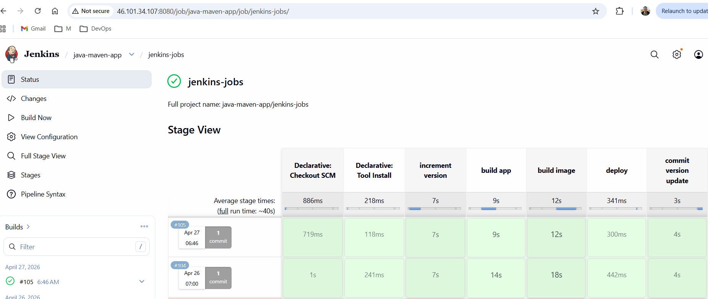
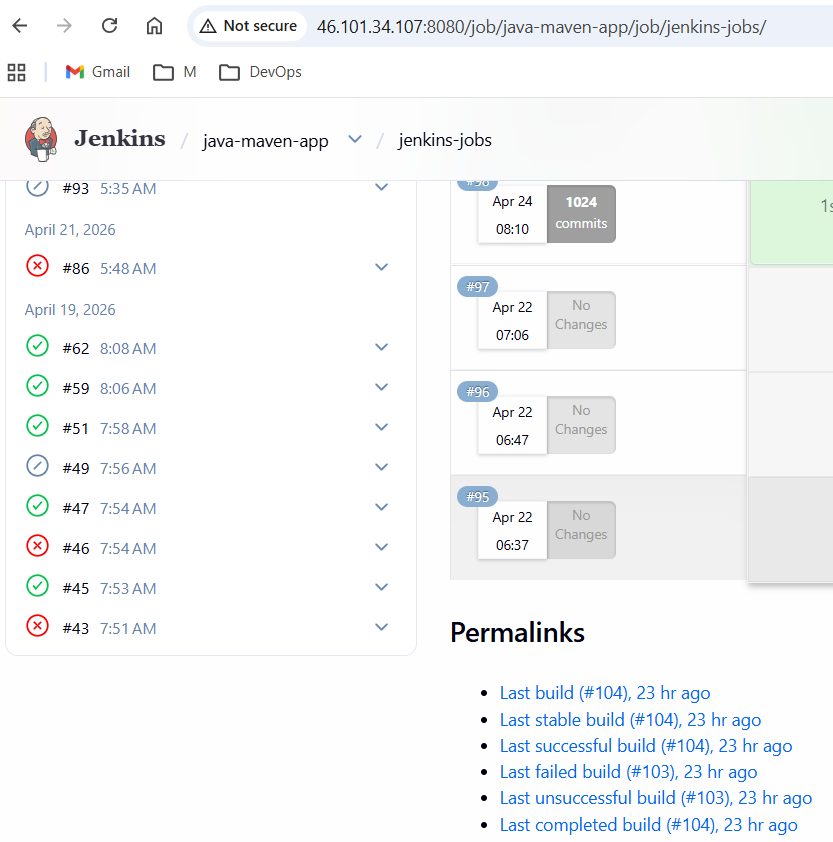
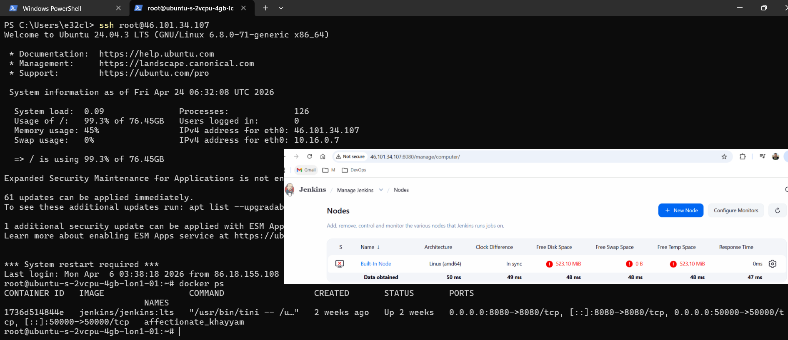
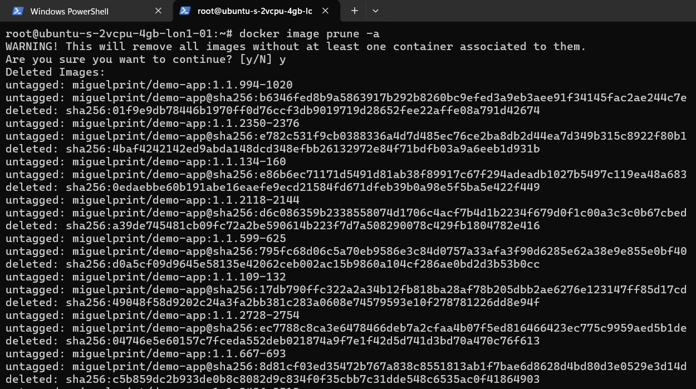

### 🚀 Capstone Project 1 – CI/CD Pipeline with Jenkins, Maven & Docker

#### 📂 Repository Branches

This project uses multiple branches to separate concerns:

- jenkins-jobs: complete CI/CD pipeline implementation (Jenkinsfile + pipeline logic)
- jenkins-shared-lib: jenkins shared library for reusable pipeline functions
- master (default): documentation and project overview

#### 📌 Project Overview

This project demonstrates a production-style CI/CD pipeline that builds, versions, and containerizes a Java application using Jenkins — including real-world failure scenarios and fixes.

The pipeline is triggered by GitHub changes and performs:

- Build automation with Maven
- Automated version incrementing
- Docker image creation
- Image tagging for traceability
- (Optional) Push to Docker Hub

#### 🎯 Goal

The goal of this project is to:

- Automate the build process of a Java Maven application
- Implement a CI/CD pipeline using Jenkins
- Apply versioning strategy for traceable releases
- Containerize the application using Docker
- Understand real-world DevOps troubleshooting (Git, Jenkins, credentials, disk issues)

#### 🏗️ Architecture

`GitHub → Webhook → Jenkins Pipeline → Maven Build → Docker Build → (Docker Hub)`

#### ⚙️ Tech Stack

| Area | Technologies |
|------|--------------|
| CI/CD | Jenkins |
| Build Tool | Apache Maven |
| Language | Java |
| Containerization | Docker |
| Source Control | GitHub |
| IDE | Visual Studio Code |

#### 📂 Repository Structure

```
java-maven-app/
│
├── Jenkinsfile              # CI/CD pipeline definition
├── pom.xml                  # Maven build configuration
├── Dockerfile               # Docker image build instructions
├── src/                     # Application source code
└── README.md                # Project documentation
```

#### 🔄 CI/CD Pipeline Breakdown

**1. Increment Version**
- Uses Maven plugin:

```
build-helper:parse-version
versions:set
```

- Automatically increments version on every pipeline run
- Ensures consistent and traceable builds

**2. Build Application**

- Compiles Java code
- Runs tests
- Packages application into a `.jar` file

**3. Build Docker Image**

- Uses Dockerfile based on: `amazoncorretto:17-alpine-jdk`
- Creates versioned image: `<version>-<build-number>`
Example: `1.1.2-98`

**4. Push Docker Image (Optional)**

- Pushes image to Docker Hub
- Uses Jenkins credentials for authentication

#### 🔑 Key Features

- Automated CI/CD pipeline using Jenkins
- Dynamic versioning for every build
- Docker image creation with unique tags
- GitHub webhook integration (auto-trigger builds)
- Pipeline-as-Code using Jenkinsfile
- Real-world DevOps debugging experience

Below is a successful pipeline run showing all stages executing:



#### 🧪 Real-World Challenges & Fixes

##### ❌ Issue: CI/CD Pipeline Loop (Multiple Builds Triggering Continuously)

**👉 Impact:**

- Multiple builds triggered back-to-back
- Jenkins node disk space rapidly consumed
- Dozens of Docker images pushed unnecessarily
- Risk of pipeline instability and resource exhaustion

This is the kind of issue that can quietly escalate in production and increase infrastructure cost.

This shows multiple pipeline runs including failures and disk space failure:





#### 🔍 Root Cause:

The pipeline was triggering itself repeatedly due to a misconfiguration between:

- GitHub webhook triggers
- Jenkins pipeline behavior (commit/push inside pipeline)

#### ✅ Fix:

- Identified recursive trigger pattern
- Adjusted pipeline logic to prevent self-triggering
- Cleaned up Jenkins workspace and old builds
- Removed unused Docker images

Below shows cleaning up unused docker images:



#### 💡 DevOps Insight:

CI/CD pipelines must be designed to avoid recursive execution.

In production environments, this can lead to:

- Uncontrolled infrastructure usage
- Increased cloud costs (compute + storage)
- System instability

#### 🚀 How to Run the Project

**1. Clone Repository**

`git clone https://github.com/migi-devops/java-maven-app.git
cd java-maven-app`

**2. Configure Jenkins**

- Create a Multibranch Pipeline
- Connect GitHub repository
- Add credentials: GitHub PAT and Docker Hub (optional)

**3. Trigger Pipeline**

- Push code to repository OR
- Trigger manually in Jenkins

#### 📊 What I Built

I created a CI/CD pipeline that:

- Automatically builds a Java application
- Increments version on every run
- Packages the app into a Docker image
- Tags images for traceability
- Integrates GitHub with Jenkins using webhooks

#### 📌 Project Summary (In a Nutshell)

This project demonstrates a real-world CI/CD pipeline using Jenkins that automates building, versioning, and containerizing a Java application.

It highlights core DevOps practices:

- CI/CD automation
- Pipeline as Code
- Version control integration
- Containerization
- Troubleshooting production-like issues

#### 🔮 Next Improvements (Roadmap)

- Push images to AWS ECR
- Deploy to Kubernetes (EKS)
- Use Jenkins Shared Library
- Add automated testing stages
- Implement monitoring & logging

**Author:** Miguel (DevOps Engineer)

**Reference:** This project is based on concepts from the [TechWorld with Nana DevOps Bootcamp](https://www.techworld-with-nana.com/devops-bootcamp), extended with additional debugging scenarios and real-world improvements.
